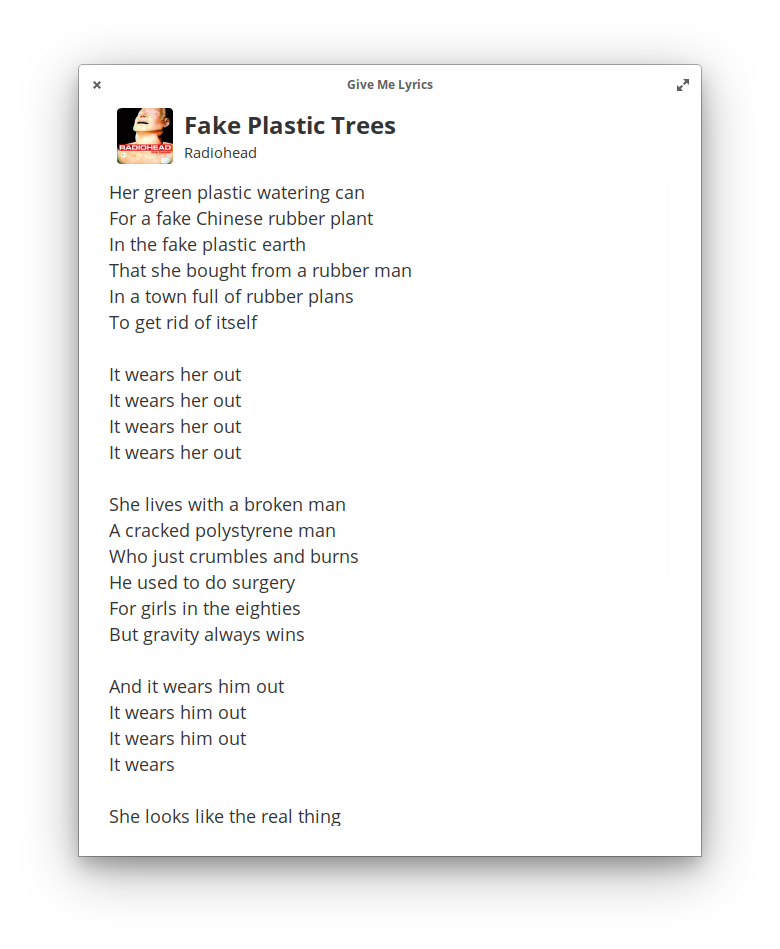
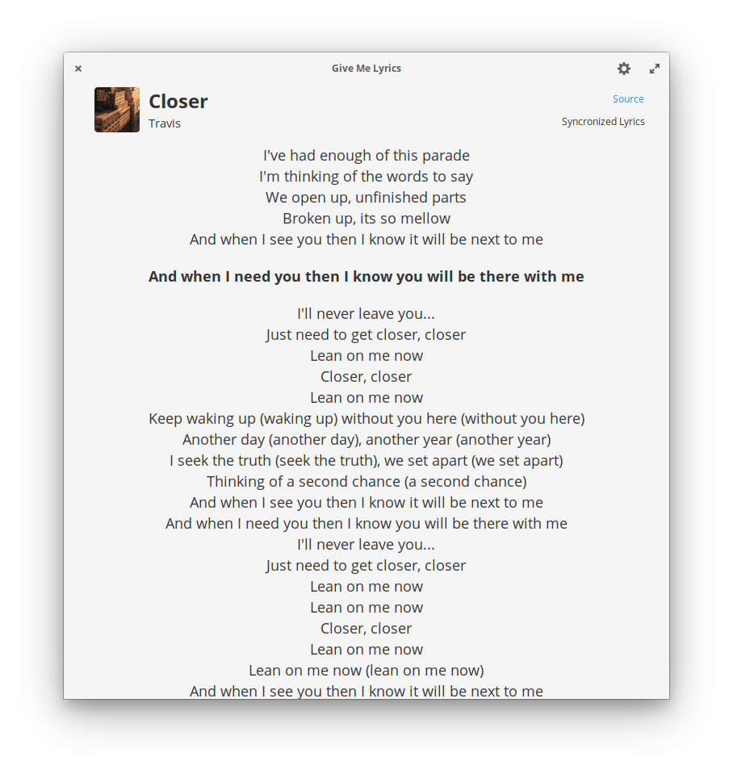

<h1 align="center">Give Me Lyrics</h1>

See the lyrics of the song that is playing, from any application.

  

### Online Sources

* 163 music
* Lyrics Wikia
* API Seeds
* Letras.mus.br

### Syncronized Lyrics (beta)
Sync the lyrics of the songs. Some points to consider:

* The amount of music with this feature is limited (if you know of a reliable source of synchronized lyrics open a issue please).
* Some music applications do not provide the position of the song running through the MPRIS interface (eg Spotify), so manual changes to the song position (Seek) will not be tracked by the application.
* There are cases where the synchronization was done in a different version of the song being played (acoustic, live, etc).

### Donate
<a href="https://www.paypal.com/cgi-bin/webscr?cmd=_donations&business=YQ7R5KQJPUNNU&currency_code=BRL&source=url">PayPal</a> | <a href="https://www.patreon.com/muriloventuroso">Patreon</a>

## Developing and Building

If you want to hack on and build Give Me Lyrics yourself, you'll need the following dependencies:

* libgtk-3-dev
* libgranite-dev
* meson
* valac
* libxml2-dev
* libsoup2.4-dev
* libjson-glib-dev

Run `meson build` to configure the build environment and run `ninja test` to build and run automated tests

    meson build --prefix=/usr
    cd build
    ninja test

To install, use `ninja install`, then execute with `com.github.muriloventuroso.givemelyrics`

    sudo ninja install
    com.github.muriloventuroso.givemelyrics

-----

